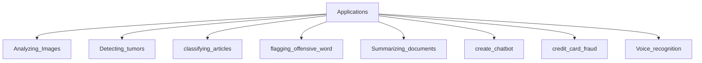
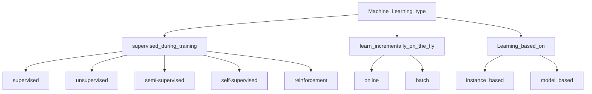

# Chapter One: The Machine Learning Landscape

---

### **In this chapter, we will:**

- Define what is machine learning (ML)?
- Why we should use ML?
- Present applications of ML.
- List ML algorithm types.
    - Supervised versus Unsupervised Learning
    - Online versus batch learning
    - Instance-based versus model-based learning
- Go over a few practical examples.
- Talk about common challenges when using ML

---

# What is machine Learning (ML)

> Field of study that gives computers the ability to learn without being explicitly programmed.
—Arthur Samuel, 1959
> 

> **A computer program is said to** 
*  learn from experience E
*  with respect to some task T 
* and some performance measure P
if its performance on T, as measured by P, improves with experience E.
—Tom Mitchell, 1997
> 

# Why use Machine Learning?

When building non-learners, we usually follow these steps:

1. We make rules
2. We write an algorithm
3. If the algorithm performs well, we deploy. If not, we go back to step `1`

<aside>
⛔ If the problem is complex, we'll likely endup with a long list of rules that are hard to 
maintain and scale to other similar problems.

An ML system would be much shorter, easier to maintain, and in many cases, more accurate.

</aside>

We can simply train an algorithm on a large dataset, then inspect the algorithm's `feature importance` coefficient to gain a better understanding of the relation between the data & the problem. This is called data mining.

# Present applications of ML

### **Notes**

- `Image Classification`: typically performed using convolutional neural networks.
- `Semantic segmentation`: the algorithm is trained to classify each pixel in an image, one example of this is brain tumor detection.
- `Natural Language Processing` (NLP): More specifically, text classification, which can be learned using RNNs, CNNs, or Transformers.
- Chatbots: Involve many NLP tasks such as Natural Language Understanding (NLU) and Question-Answering.
- Forecasting future revenue: a regression task that can be tackled using multiple algorithms such as:
    - Linear Regression
    - Polynomial Regression
    - SVM
    - Random Forest
    - Artificial Neural Networks
- `Speech recognition`: this problem can be tackled by recognizing the incoming audio signals using RNNs, CNNs or Transformers.
- Credit card fraud detection: detecting frauds can be solved using supervised (classification) or unsupervised (anomaly detection) learning.
- `Clustering`: segmenting clients based on their purchases so we can design targeted & more effective marketing campaigns.
- `Dimensionality reduction`: useful for high-dimensional data visualization and cluster analysis. It can be solved using algorithms such as `PCA` or `T-SNE`.
- `Recommender systems`: where we can feed in the sequence of client purchases (for example) to an artificial neural network to predict the next purchase

# Type of Machine Learning

