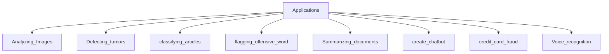
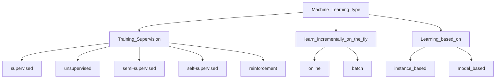
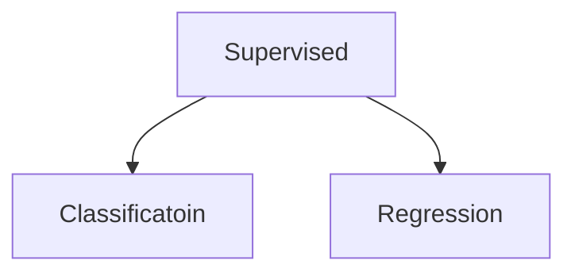
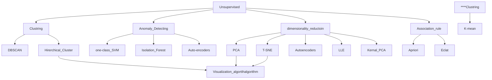

# Chapter One: The Machine Learning Landscape

---

**In this chapter, we will:**

- Define what is machine learning (ML)?
- Why we should use ML?
- Present applications of ML.
- List ML algorithm types.
    - Training supervision
    - Online versus batch learning
    - Instance-based versus model-based learning
- Talk about common challenges when using ML

---

# What is machine Learning (ML)

> Field of study that gives computers the ability to learn without being explicitly programmed.
—Arthur Samuel, 1959
> 

> **A computer program is said to** 
*  learn from experience E
*  with respect to some task T 
* and some performance measure P
if its performance on T, as measured by P, improves with experience E.
—Tom Mitchell, 1997
> 

# Why use Machine Learning?

When building non-learners, we usually follow these steps:

1. We make rules
2. We write an algorithm
3. If the algorithm performs well, we deploy. If not, we go back to step `1`

<aside>
⛔ If the problem is complex, we'll likely endup with a long list of rules that are hard to 
maintain and scale to other similar problems.

An ML system would be much shorter, easier to maintain, and in many cases, more accurate.

</aside>

We can simply train an algorithm on a large dataset, then inspect the algorithm's `feature importance` coefficient to gain a better understanding of the relation between the data & the problem. This is called data mining.

# Present applications of ML



### **Notes**

- `Image Classification`: typically performed using convolutional neural networks.
- `Semantic segmentation`: the algorithm is trained to classify each pixel in an image, one example of this is brain tumor detection.
- `Natural Language Processing` (NLP): More specifically, text classification, which can be learned using RNNs, CNNs, or Transformers.
- Chatbots: Involve many NLP tasks such as Natural Language Understanding (NLU) and Question-Answering.
- Forecasting future revenue: a regression task that can be tackled using multiple algorithms such as:
    - Linear Regression
    - Polynomial Regression
    - SVM
    - Random Forest
    - Artificial Neural Networks
- `Speech recognition`: this problem can be tackled by recognizing the incoming audio signals using RNNs, CNNs or Transformers.
- Credit card fraud detection: detecting frauds can be solved using supervised (classification) or unsupervised (anomaly detection) learning.
- `Clustering`: segmenting clients based on their purchases so we can design targeted & more effective marketing campaigns.
- `Dimensionality reduction`: useful for high-dimensional data visualization and cluster analysis. It can be solved using algorithms such as `PCA` or `T-SNE`.
- `Recommender systems`: where we can feed in the sequence of client purchases (for example) to an artificial neural network to predict the next purchase

# Type of Machine Learning



## Training supervision

> ML systems can be classified according to
> 
> - the amount of supervision
> - type of supervision
> 
> they get during training.
> 

### 1. Supervised learning

> the training set you feed to the algorithm includes desired solutions, called labels
> 



*classification example* 

The spam filter
it is trained with many example emails along with their class (spam or ham),
and it must learn how to classify new emails.

<p align="center">
  
</p>

*Regression example* 

The price of a car
given a set of features (mileage, age, brand, etc.). To train the system, you need to give it many examples of cars, including both their features 
and their targets (i.e., their prices).

<p align="center">
  
</p>

> 💡 **Note**  
      Label → more common in classification
      Target → more common in Regressions
> 

 

### 2. unsupervised learning

> the system tries to learn without a teacher & find connections without your help
> 



*Clustering example* 

The Visitors Clustering 

<p align="center">
  
</p>


Unlabeled Training set of visitors 

<p align="center">
  
</p>


Clustering the visitors 

*Visualization algorithm example* 

you feed them a lot of complex and unlabeled data, and they output a 2D or 3D representation 

<p align="center">
  
</p>

Example of a t-SNE visualization highlighting semantic clusters2

*Dimensionality reduction example* 

car’s mileage may be strongly correlated with its age,
so the dimensionality reduction algorithm will merge them into one feature the car’s wear and tear.
this is called —> feature extraction 

> 💡 **Note**  
      reduce the number of dimensions in your training data using a 
      dimensionality reduction algorithm before you feed it to another machine 
      learning algorithm 
      → It will run much faster
      → the data will take up less disk and memory space
      → perform better
> 

*Anomaly detection*

detect unusual credit card transaction to prevent fraud

<p align="center">
  
</p>

*Association rule learning* 

suppose you own a supermarket. Running an association rule
on your sales logs may reveal that people who purchase barbecue sauce & potato
chips also tend to buy steak.
Thus, you may want to place these items close to one another.

### Semi-supervised

> algorithms can deal with data that’s partially labeled
> 

<p align="center">
  
</p>

circles → unlabeled data
Triangles & Squires → labeled data 
you can clustering unlabeled “circles” according to labeled data  

*google photos* 

first clusters peoples with same shapes 
then if you labeled any one of the photo it will give name to the same persons

### Reinforcement Learning

> called an agent in the context 
1- can observe the environment
2- select action 
3- preform actions 
4- get rewards in return 

It must then learn by itself what is the best strategy, called a policy, to get the most reward over time
> 
> 
> A policy defines what action the agent should choose
> when it is in a given situation
> 

<p align="center">
  
</p>


Summarize The previous Model Type


## Batch Vs Online learning

### **Batch Learnings**

- trained using all the available data (offline)
- Launched into production & runs without learning anymore

**Pross:** 

- easier to implement
- Useful for
    - system that not change rapidly
    - have a lot of resources

************cons:************ 

- trained using all the available data (not learning incrementally)
- so, it takes a lot of time and computing resources
- model’s performance tends to decay slowly over time, *cause world evolve*
    - solution of this point
        - train a new version of the system from scratch on the full dataset new & old
        - replace the old model with the new one.

### Online learning

- *Trained incrementally* by feeding data instances sequentially (individually or small groups ”mini-batches”
- Each learning step is fast and cheap → system learn on fly as data arrives

**************Pros:**************

- useful for
    - system that change extremally rapidly
    - have limited in computing resources
    - out of core learning: *deal with huge dataset that can’t fit main memory*
        - loads part & run training steps (repeat until done)

**********cons:********** 

- hard to implement
- Hard to choose good data, and if the system has bad data will performances decline
    - Note: bad data depend on data quality & Learning rate

> 💡 Learning rate 
      parameter determine how fast system should adapt to changing the data 
      → high learning rate: system rapidly adapt, but quickly forget the old data 
      → low learning rate:   system small adapt, but system slightly adapt to new data
> 

## how generalize (Instance-based Vs Model-based Learning )

### Instance-based **Learning**

> system learns the examples by heart
then generalizes to new cases by using a similarity measure to compare them to the learned examples
> 

<p align="center">
  
</p>


new instance would be classified as a triangle because the majority of the most similar instances belong to that class.

as you see it start from the heart and generalize new case around it 

Example: 

- K-Nearest Neighbors

### model-based

> build a model of these examples and then use that model to make predictions.
> 

<p align="center">
  
</p>


here model is trained and understand the data so it can easily make predictions 

as you see it learned weights value & base value after trained data 

Example: 

- Support Victor Machine SVM

### Code implement for Model & Instance based

******************************************How to build a model****************************************** 

- Studied the data
- select the model
- Train the model
- apply the model to predict

**1- Studied the data set** 

- import the library's

```python
import matplotlib.pyplot as plt
import numpy as np
import pandas as pd
from sklearn.linear_model import LinearRegression
```

- Download data

```python
data_root = "https://github.com/ageron/data/raw/main/"
```

- prepare the data

```python
lifesat = pd.read_csv(data_root + "lifesat/lifesat.csv")
X = lifesat[["GDP per capita (USD)"]].values
y = lifesat[["Life satisfaction"]].values
```

- Visualize the data

```python
lifesat.plot(kind='scatter', grid=True,
x="GDP per capita (USD)", y="Life satisfaction")
plt.axis([23_500, 62_500, 4, 9])
plt.show()
```

<p align="center">
  
</p>


after study the dataset it tend to be linear 

**2- Select the model** 

- we select the ***linear regression*** model case model based
    
    ```python
    from sklearn.linear_model import LinearRegression
    model = LinearRegression()
    ```
    
- and select the K-mean model case model based
    
    ```python
    from sklearn.neighbors import KNeighborsRegressor
    model = KNeighborsRegressor(n_neighbors=3)
    ```
    

**3- Train the model** 

```python
model.fit(X, y)
```

**4- Apply the model to predict**

```python
X_new =  list(range(23_500, 62_500,1000)) 
Y_new = [model.predict([[i]])[0][0] for i in X_new ]
```

```python
# Visualize the data
lifesat.plot(kind='scatter', grid=True,
x="GDP per capita (USD)", y="Life satisfaction")
plt.axis([23_500, 62_500, 4, 9])
plt.plot(X_new, Y_new, color ="r")
plt.show()
```


<p align="center">
  
</p>


# Main Challenges of Machine Learning

your main task is to select a model and train it on some data

## 1- Training Data Problems

### **Insufficient quantity of training data**

- Simple problems → Thousand of examples
- Complex problems → Millions of examples (unless you reuse parts of existing model

### Non representative Training Data

### Poor quality data

    data full of errors, outliers & noise 

Solution:

- Clearly outliers → discard them or fix error manually
- Missing few features →
    - ignore the attributes that missing
    - or fill in them
    - or train one model with this features and one model without it

### Irrelevant Features

system will only be capable of learning if the training data contains enough relevant features and not too many irrelevant ones.

***feature engineering*** (coming up with good set of features to train)

- ******************************************************Feature selection →****************************************************** select the most useful features to train
- *********************************************************Feature extraction →********************************************************* combining existing features to produce a more useful one(dim-reduction)
- ***Create new Features***

## 2- Training Algorithm Problem

### Overfitting

> model performs well on the training data, but it does not generalize well.
> 

**Overfitting happens when the model is** 

- too complex relative to the amount and noisiness of the training data.

**Solutions:**

- **Simplify the model → select one with fewer parameters**
    - linear model rather than a high-degree polynomial
    model),
    - reducing the number of attributes in the training
    data, or by constraining the model.
- **Gather more training data.**
- **Reduce the noise in the training data**
    - fix data errors
    - remove outliers
- ******************************Regularization******************************
    
    If we take the example of a single linear regression model $f = a*x + b$, it has two degrees of freedom (2 parameters). 
    
    - If we let the algorithm change one parameter's values freely
    - but have a set interval around parameter 2, it will have between 1 and 2 degree of freedom.
    
    We would want a good balance between keeping the model as simple as possible while giving the model the ability to capture out of training data patterns.
    
    ***model's hyperparameters*** 
    which describe how the model should learn & this can control  Regularization
    <p align="center">
  
</p>


    
    doted  → prediction for circles (without regularization)
    dashed →predictions for circles (with  regularization)
    Soled   → prediction of all data (circles &squares)
    
    ***doted line*** best for predict current data (circle), bad at other data squares → overfitting
    
    ***dashed line** not god as doted in* predict current data (circle), but is good at other data squares & it similar to solid line so   → no overfitting in this line 
    

**Solutions:**

### Underfitting

> model is too simple to learn the underlying structure of the data.
> 
- **Select a more powerful model, with more parameters.**
- **Feed better features to the learning algorithm (feature engineering).**
- **Reduce the constraints on the model**
    - reducing the regularization hyperparameter

**your model needs to be neither too simple (in which case it will underfit) nor too complex (in which case it will overfit).**

### Testing & Validating

evaluate model by splitting the data into two sets: 

- **training** data sets. → take 80% of the whole dataset
- **testing** data sets → take 20% of the whole dataset

We only care about ***`out-of-training error`, or `generalization error`***, as it is representative of the model's performance in a production environment.

> ***generalization error***  it is error from the test set 
***********Overfitting*********** have low Training error & high *generalization* error
> 

**Hyperparameter Tuning & Model Selection** 

If we fine-tune regularization parameters on the test set, we are sort of overfitting to it, so we need another data set for hyper-parameter tuning, this data set is usually called the **`validation set`**.  `development set`  or `dev set`
The validation set should be set aside from the training set. After conducting hyper-parameter tuning on using the validation set, we train the model on the full training set (with validation) & evaluate on the test set.

<p align="center">
  
</p>


**Data Mismatch**

if the algorithm is performing poorly on the validation set, we won't know if the cause is

- overfitting
- or if the training set isn't good for the task at hand

Solution

1- introduce another validation set, called 'train-dev' set. After training, we will 
     validate the model on both `train-dev`  & validation sets.

- If evaluation is **good** on `train-dev`  & **bad** on `validation`
→ this means that the data is not good for the task at hand. (data proplem)
- If evaluation is bad on `train-dev`  & bad on `validation`
→  this means overfitting or the algorithm/overall data is not good.(model proplem)

We should think of a model as a simplified version of the observations. 
This simplification is meant to discard noise and capture generalizable useful patterns in the training and testing datasets. To decide what information to discard and what to keep, you must make assumptions. For example, a linear model assumes that the relation between the input & output is fundamentally linear & the distance between the model line and the observations is essentially **noise**.

If we make no assumptions about the data, than there is no need to prefer one model over another. This is the point behind the "no free lunch theorem", which states the following:

> [David Wolpert & William Macready] Any two optimization algorithms are equivalent when their performance is averaged across all possible problems
>
